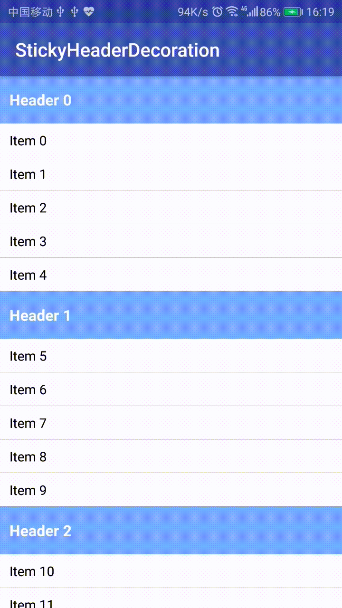

## StickyHeaderDecoration

使用ItemDecoration技术实现的粘性头部，用于实现RecyclerView的分组效果。


#### 实现原理及优势？
ItemDecoration 有两个绘制时机：`onDraw` 和 `onDrawOver`，其中`onDrawOver`是在item绘制完成之后。  
**RecyclerView本身并没有提供可以固定某个item或者某个canvas的方法。** 
因此要实现粘性头部，只能通过假的视图来完成。

我们当然可以在RecyclerView上贴一个View，然后监听RecyclerView的滚动来实现吸顶效果。具体做法参见[这里](http://www.jianshu.com/p/c596f2e6f587). 但是，这个方案有两个问题：
 * 增加了xml的布局复杂度
 * 每个需要吸顶的页面都要重复一遍fake view + scroll listen的代码，代码重复率高且不易维护

使用 ItemDecoration 技术可以解决这两个问题。

#### 如何使用？
很简单，就像加分割线一样清晰、简洁！
```
    recyclerView.addItemDecoration(new StickyHeaderDecoration(headerAdapter));
```
其中，`headerAdapter`负责提供分组逻辑，这个接口定义如下(此处省略文档注释，请参考实际代码)：
```Java
public interface StickyHeaderAdapter<T extends RecyclerView.ViewHolder> {

    long getHeaderId(int childAdapterPosition);
    
    @NonNull T onCreateHeaderViewHolder(ViewGroup parent);
    
    void onBindHeaderViewHolder(@NonNull T holder, int childAdapterPosition);
}
```

#### 使用Decoration实现合适么？
> An ItemDecoration allows the application to add a special drawing and layout offset to specific 
item views from the adapter's data set. This can be useful for drawing dividers between items, 
highlights, **visual grouping boundaries** and more.

上面这段文字出自官方文档[RecyclerView.ItemDecoration](https://developer.android.com/reference/android/support/v7/widget/RecyclerView.ItemDecoration.html).
也就是说，ItemDecoration设计用途之一就是绘制分组间距。所以我对这个方案的合法性是很有信心的 XD

#### Licence
```
   Copyright 2017 Muyangmin

   Licensed under the Apache License, Version 2.0 (the "License");
   you may not use this file except in compliance with the License.
   You may obtain a copy of the License at

       http://www.apache.org/licenses/LICENSE-2.0

   Unless required by applicable law or agreed to in writing, software
   distributed under the License is distributed on an "AS IS" BASIS,
   WITHOUT WARRANTIES OR CONDITIONS OF ANY KIND, either express or implied.
   See the License for the specific language governing permissions and
   limitations under the License.

```